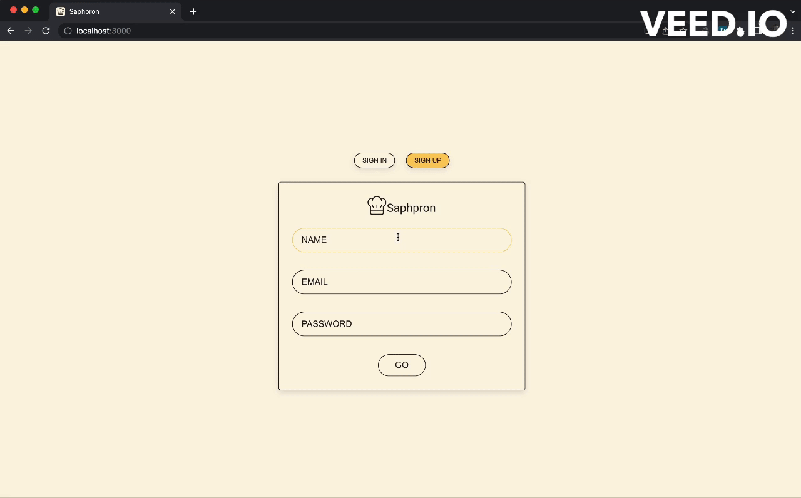
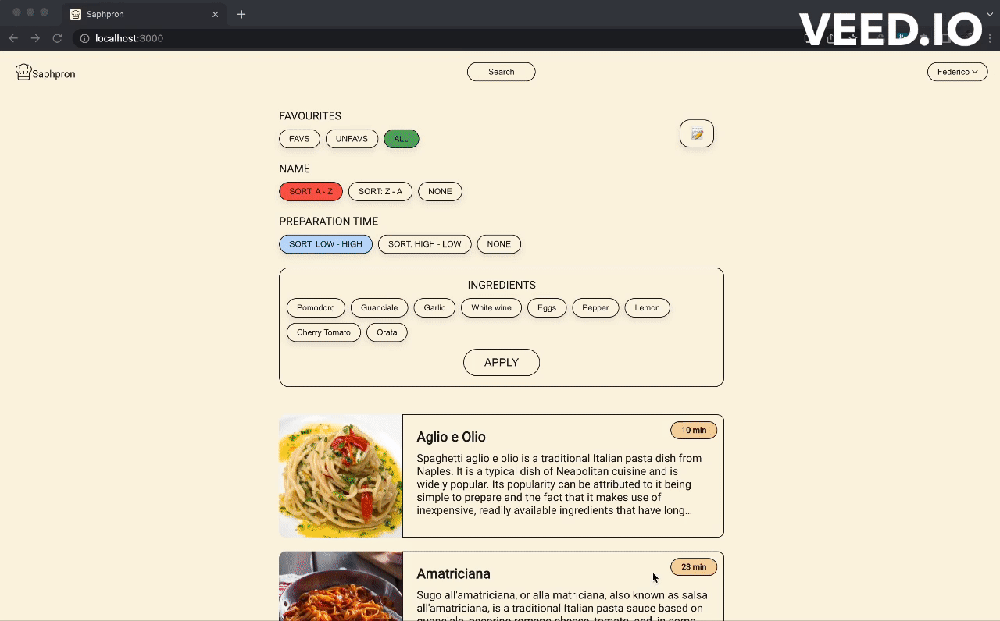

# Saphpron: Your Digital Cookbook
Saphpron is a user-friendly web app that simplifies the way you organize and access your favorite recipes. 

## Introduction
With Saphpron, you can effortlessly store and browse your recipes on the fly, transforming your culinary experience. Say goodbye to traditional recipe cards and embrace the convenience of a digital cookbook. Built with **React** and powered by a **Laravel PHP** backend, enables you to keep your cookbook always with you.

## Technologies

### Backend
- Laravel PHP
- Laravel Sanctum
- Unsplash

### Frontend 
- React 
- TypeScript
- Cloudinary

## Flows

### Auth Flow

### Search

### Sort

### Create Recipe

